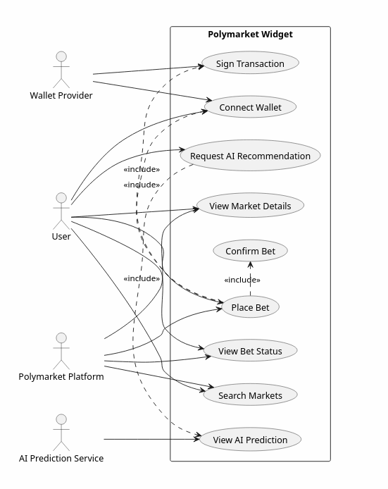
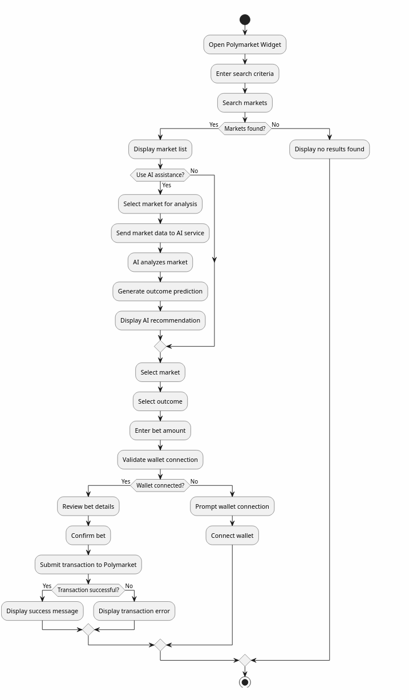
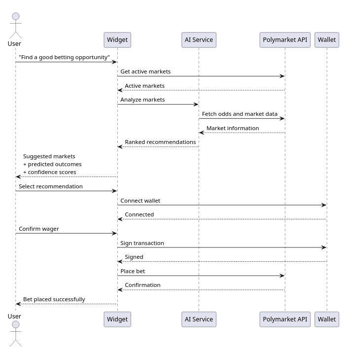
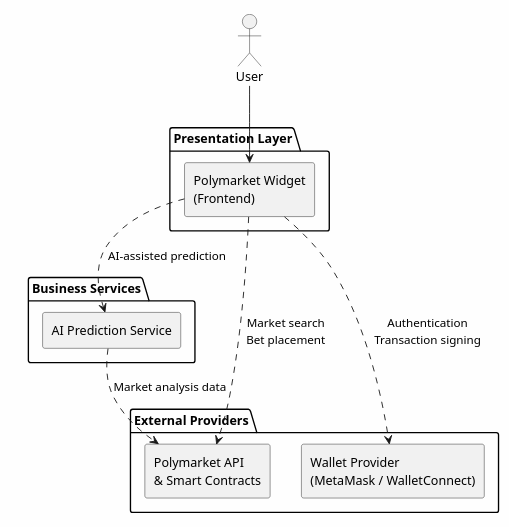

# Technical Documentation — Polymarket Widget

This document describes the architecture and interaction flows of the **Polymarket Widget**, illustrated by the diagrams in [`images/`](./images/). Each diagram models a different concern: what the system does, how a user flows through it, how the pieces talk at runtime, and how the software is structured.

> **Status note:** the diagrams are the design blueprint. The current build implements them in **paper-trading mode** — market browsing and AI recommendations are fully wired, while betting is simulated and the wallet/live-transaction steps are intentionally stubbed out. See each section for the mapping.

---

## Diagram 01 — Use Case Diagram

**Purpose:** to capture **what the widget must do** from the perspective of the actors that interact with it — a high-level functional scope with no implementation detail.

It defines three primary actors plus the system boundary:

| Actor | Role |
| --- | --- |
| **User** | The person using the widget to search markets and place bets |
| **AI Prediction Service** | External service consulted for outcome recommendations |
| **Wallet Provider** | Middleman that holds keys and signs transactions on the user's behalf |
| **Polymarket Platform** | Source of market data and the destination for real bets |

**Use cases inside the boundary:**

- **Search Markets** (`UC1`) and **View Market Details** (`UC2`) — core browsing (backed by Polymarket).
- **Request AI Recommendation** (`UC3`) → **View AI Prediction** (`UC4`) via an `<<include>>` — requesting always implies viewing the result.
- **Connect Wallet** (`UC5`), **Place Bet** (`UC6`), **Sign Transaction** (`UC7`), **Confirm Bet** (`UC8`) — the betting sequence, where placing a bet *includes* connecting a wallet, signing, and confirming.
- **View Bet Status** (`UC9`) — reading back the outcome of a placed bet.

**As implemented:** `UC1`, `UC3`, `UC4` and a paper variant of `UC6` are live; wallet steps (`UC5`, `UC7`, `UC8`) are deferred until live trading is added.

---

## Diagram 02 — Activity Diagram

**Purpose:** to model the **end-to-end user journey** as a single workflow — the actions, decision branches, and failure paths the UI must support, in the order the user experiences them.

The flow cover three phases:

1. **Discovery** — open the widget → search → branch on whether markets were found (empty state shown if not).
2. **AI assistance (optional branch)** — pick a market, send its data to the AI service, and display the generated recommendation, or skip AI entirely.
3. **Betting** — select market → choose outcome → enter amount → check wallet connection (prompting + connecting if missing) → review → confirm → submit to Polymarket, branching on success vs. error at each step.

**Purpose value:** it is the canonical "happy path + guard rails" spec — the source of truth for which states the UI sketches must render (list, empty state, recommendation, confirm, success, error, connect-wallet prompt).

**As implemented:** discovery and AI branches match production behavior. The betting branch is simulated: the widget validates the order locally and records a **paper fill** instead of submitting to Polymarket.

---

## Diagram 03 — Sequence Diagram

**Purpose:** to show the **temporal message flow** between the User, the Widget, the AI service, the Wallet, and the Polymarket API for the three core interactions.

- **Search Markets** — user keyword → widget queries Polymarket → markets returned and displayed. (One round-trip.)
- **AI Recommendation** — user requests a prediction → widget calls AI → AI pulls market odds from Polymarket → AI replies with outcome + confidence → widget renders it.
- **Place Bet** — user picks outcome/amount → widget verifies wallet (connect if missing) → presents review → user confirms → wallet signs → widget submits → success/error surfaced to the user.

**Purpose value:** it pinpoints the exact request/response contract and the **ordering constraints** (e.g., the wallet must be connected *before* the bet can be signed; the transaction must be confirmed *before* the status is shown). These contracts map one-to-one onto the API routes.

**As implemented:** Search and AI flows match. In the quote/paper flow the wallet leg is absent: `POST /api/bet` validates the order, computes a simulated fill, and returns it directly to the UI.

---

## Diagram 04 — Component Diagram

**Purpose:** to describe the **static structure** — the top-level runtime components of the system and the direction of their data/control dependencies.

| Component | Responsibility |
| --- | --- |
| **Polymarket Widget (Frontend)** | Single-page UI; the orchestrator that intermediates everything |
| **AI Prediction Service** | Produces outcome predictions from market data |
| **Wallet Provider (MetaMask / WalletConnect)** | Connection + transaction signing |
| **Polymarket API & Smart Contracts** | Market discovery, bet submission, settlement |

Key dependencies:

- Widget → AI ⇄ Polymarket: the AI reads odds from Polymarket on the widget's behalf.
- Widget → Wallet: connect and sign.
- Widget → Polymarket: search and bet.
- AI → Polymarket: fetches the market data it needs to reason.

**Purpose value:** the deployment boundary and interface surface — which services the widget depends on and in which direction. The DI-style seam around the executor (paper vs. live) is the fork in this structure that selects the bet-transport backend.

**As implemented:** the widget and AI components are real. The **Wallet** component has no live counterpart (paper mode needs no signature), and **Polymarket** is used read-only via the Gamma API for markets; real bet submission awaits the relayer integration in the executor (`src/server/lib/executor.ts`).

---

## Summary

| Diagram | Viewpoint | Question it answers |
| --- | --- | --- |
| 01 Use Case | Functional scope | *What must the widget do?* |
| 02 Activity | User workflow | *How does a user move through the app?* |
| 03 Sequence | Runtime interaction | *In what order do the parts talk?* |
| 04 Component | Static structure | *What talks to what, and how is it deployed?* |

The diagrams act as the shared contract for the codebase: `src/client` implements the widget UI, `src/server` implements the widget's API (with the executor seam splitting paper from the future live trading), and both map back to the flows above.